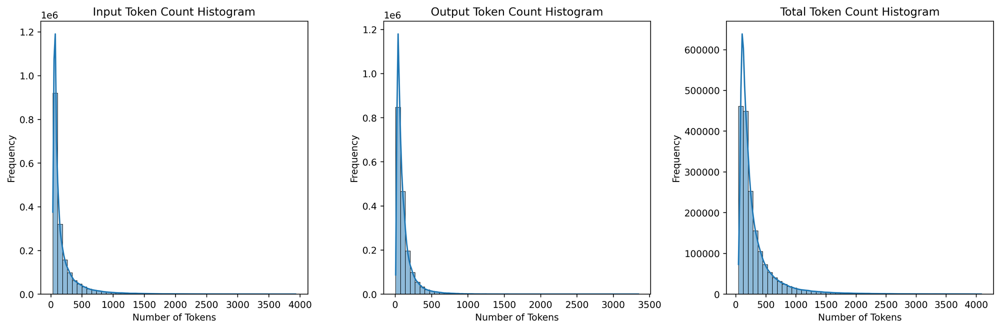
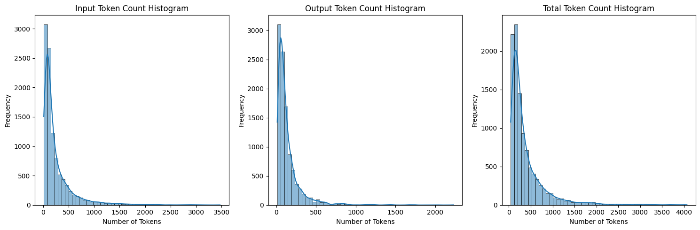
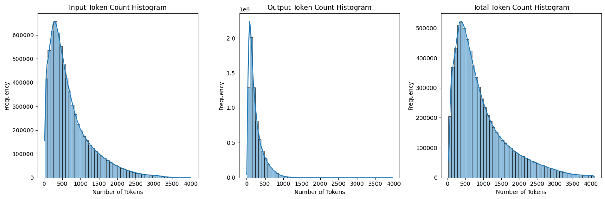
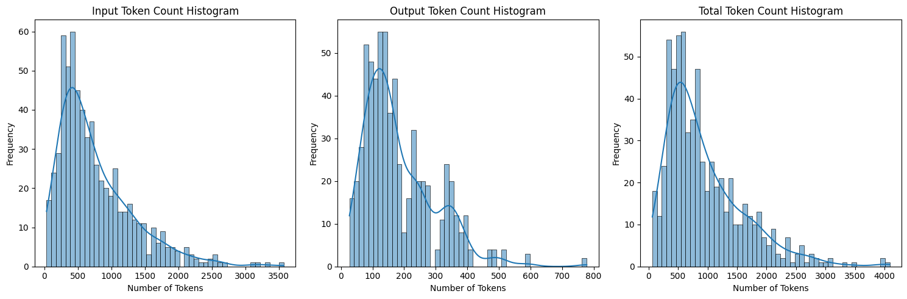
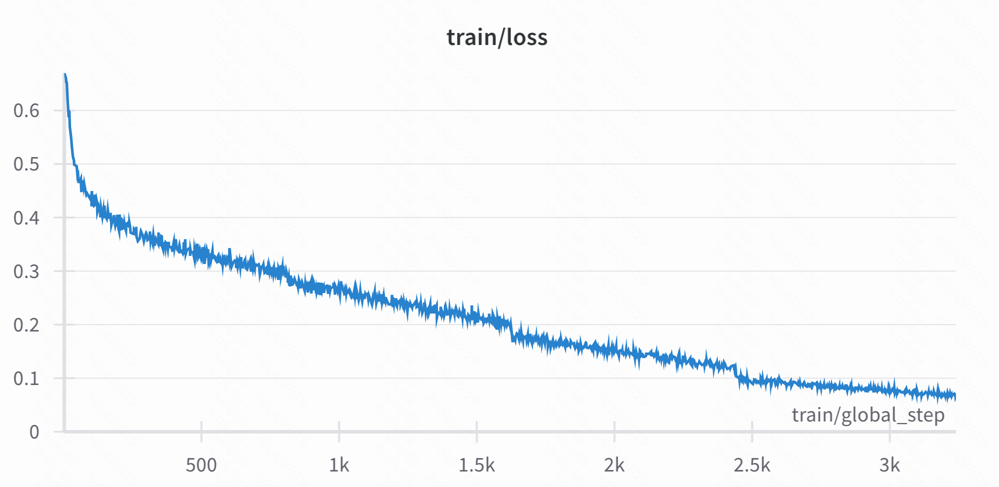
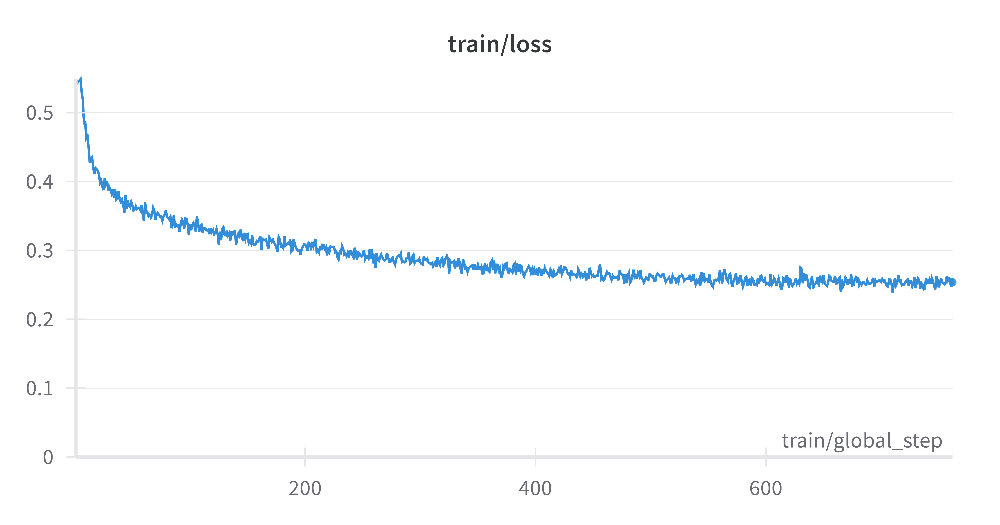

### Histogram for Executable Training Data

### Histogram for Exebench-Test

### Histogram for Compilable Training Data

### Histogram for Decompile-Eval

### LLM4Decompile-1.3B-Ref training loss for 4 epochs

### LLM4Decompile-6.7B-Ref training loss for 1 epoch

